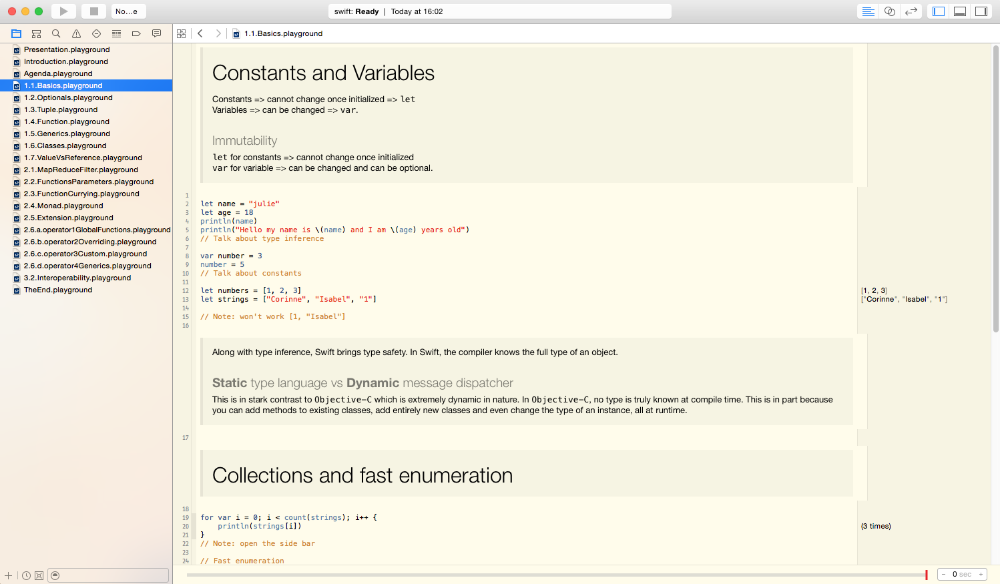

swift
=====

Tell me about Swift in a nutshell... Show me in playground!
This presentation was initially given at [SoftShake 2014](http://soft-shake.ch/2014/en/). Since then, it has evolved to become my Swift toolbox. Here you can find experiments and trial. If you have some good tips to share, pull requests are welcome.

It runs on Xcode 7-beta2. 

Playgrounds running on previous version of Xcode and Swift could be found in branches:

* xcode6.2 (with HTML and swift)
* xcode6.3 (with markdown)

### How to use it

```
git clone https://github.com/corinnekrych/swift
cd swift
open ToolBox.playground
```
### Go through interactive playground



Happy Swifting!
